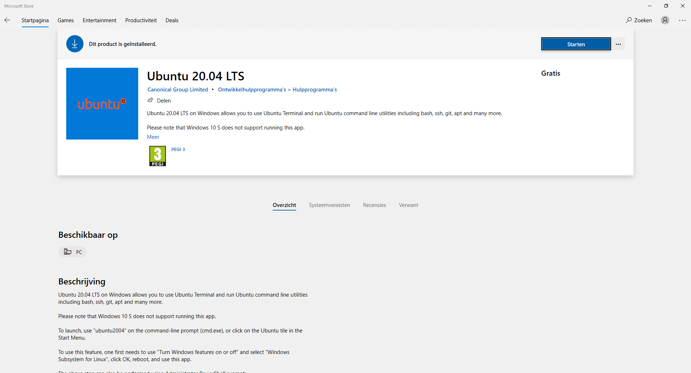

Ansible voorbereidingen
=======================

Voor het opzetten van de Ansible master server kan gebruik worden gemaakt van het ansible-setup script. Het script voert de volgende handelingen uit:

* Installeer Ansible
* Maak een private en public key aan
* Kopieer de public key naar een host
* Voeg hosts toe aan de Ansible inventory (/etc/ansible/hosts)
* Test de verbinding naar de host met `ansible -m ping`

Link naar `Ansible Setup Script`_

Installeren van Anible Master op Windows
----------------------------------------
1. Start Powershell met Administrator privileges en voer de onderstaande syntax uit

.. code-block::

   dism.exe /online /enable-feature /featurename:Microsoft-Windows-Subsystem-Linux /all /norestart

2. Activeer de Virtual Machine Feature door de onderstaande syntax uit te voeren

.. code-block::

   dism.exe /online /enable-feature /featurename:VirtualMachinePlatform /all /norestart

3. Download de Linux kernal update packege en voer deze uit

`WSL2 Linux Kernal package for x64 machines`_

4. Zet WSL 2 als de standaard versie

.. code-block::

   wsl --set-default-version 2

5. Installeer Linux Ubuntu via de Windows Store

6. Start de Linux Ubuntu versie op en voer na het installeren een gebruikernsaam en wachtwoord in

.. image:: images/ubuntuinstall.png
   :width: 100%
   :height: 350px
   :scale: 100%
   :alt: ubuntu install

`Extra documentatie over WSL voor Windows 10`_

Installeren van Ansible Master op Linux Ubuntu
----------------------------------------------

1. Voer de volgende commando's uit om Ansible te installeren

.. code-block::
	
	sudo apt update

.. code-block::

	sudo apt install software-properties-common

.. code-block::

	sudo apt-add-repository --yes --update ppa:ansible/ansible

.. code-block::
	
	sudo apt install ansible

Aanmaken van de private- en public-key
--------------------------------------

Verbindingen van Ansible met de nodes gaat op basis van SSH. Een goede gewoonte is om gebruik te maken van private- en public-key. Een uitleg hierover is hier te vinden:

* :doc:`ssh-private-public-key`

Configureren Ansible Hosts
--------------------------

De configuratie van de Ansible hosts worden gedaan in het bestand **/etc/ansible/hosts**

* :doc:`ansible-hosts`

Configuaratie Ansible
---------------------

* `Ansible configuratie`_

Eenvoudige test werking Ansible
-------------------------------

.. code-block::

	ansible -m ping [host]

Response:

.. code-block::

	192.168.56.236 | SUCCESS => { 
	"ansible_facts": { 
	"discovered_interpreter_python": "/usr/bin/python3" 
	}, 
	"changed": false, 
	"ping": "pong" 
	} 
	192.168.56.238 | SUCCESS => { 
	"ansible_facts": { 
	"discovered_interpreter_python": "/usr/bin/python3" 
	}, 
	"changed": false, 
	"ping": "pong" 
	} 
	192.168.56.237 | SUCCESS => { 
	"ansible_facts": { 
	"discovered_interpreter_python": "/usr/bin/python3" 
	}, 
	"changed": false, 
	"ping": "pong" 
	} 

.. External links

.. _`Ansible configuratie`: https://raw.githubusercontent.com/Poly1305/ansible-orchestration/master/jeroen/ansible-config/ansible.cfg?token=AB26NX7P6XIEUJULLQFSKV3AL46OE

.. _`Ansible Setup Script`: https://github.com/jebr/linux-scripts/tree/main/ansible-setup

.. _`WSL2 Linux Kernal package for x64 machines`: https://wslstorestorage.blob.core.windows.net/wslblob/wsl_update_x64.msi

.. _`Extra documentatie over WSL voor Windows 10`: https://docs.microsoft.com/en-us/windows/wsl/install-win10